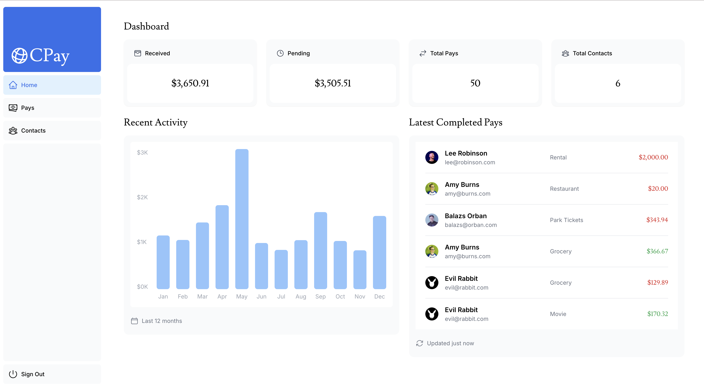
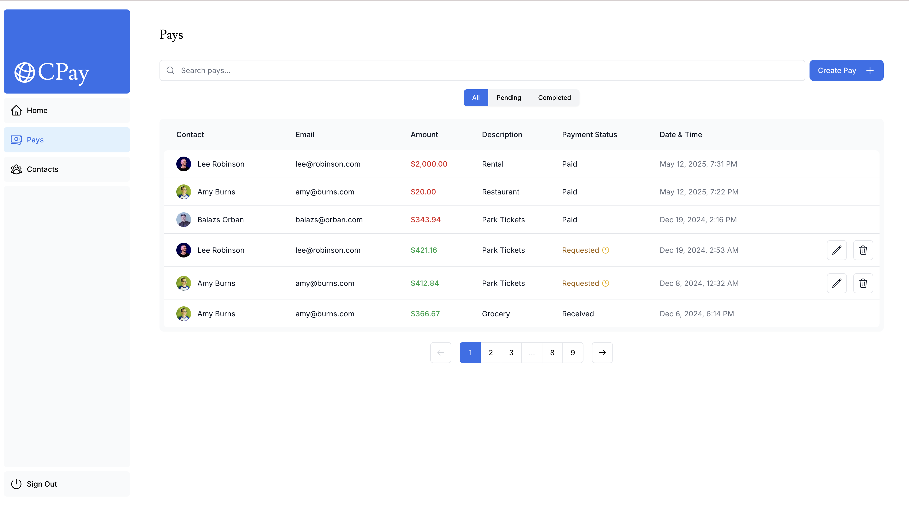
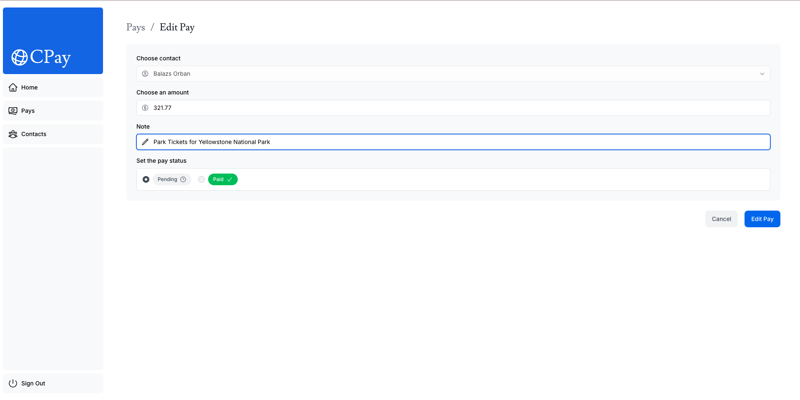

## CPay App

CPay is a simple peer-to-peer payment tracking application designed to simulate sending and receiving payments between contacts. It showcases a modern UI, mock transaction history, and real-time activity updates — great for learning and prototyping.

## Overview

The P2P payment market is booming, with projections estimating it will surpass $5.2 trillion by 2028. As more consumers and businesses adopt these technologies, being a part of this space positions you at the forefront of financial innovation and growth.

## Requirements

- Node version - v18.18.0 or higher for this version of Next.js

## Bootstrap Instructions

Follow the steps below to run this application locally:

1. **Install Node.js v20**

   Make sure Node.js version 20 is installed on your system.  
   You can download it from [https://nodejs.org/en/download](https://nodejs.org/en/download)

   Verify the version by running:
   ```bash
   node -v
   ```

2. **Install dependencies**

   Navigate to the root directory of the project and run:
   ```bash
   npm install
   ```

   > ⚠️ **Disclaimer:**  
   > This application faced build issues with `next@15` when shared.  
   > To avoid these problems, `next@14` has been explicitly installed.  
   > This will be automatically handled by `npm install`.

3. **Build the application**

   Once all dependencies are installed, build the application using:
   ```bash
   npm run build
   ```

4. **Start the application**

   After a successful build, start the app with:
   ```bash
   npm run start
   ```
   The application should now be running locally. By default, it will be available at:  
   [http://localhost:3000](http://localhost:3000)

## Built Features

Showcase Dashboard View With all the Latest Pays, Received, Pending, Total Pays, Total Contacts, Recent Activity


📋 Dynamic Pays Table
A fully rendered table displaying all pays with search, sorting, and filtering (All, Completed, Pending) capabilities.


💰 Create a New Pay Record
Add a new payment entry with required fields (e.g., amount, description, contact) directly into an in-memory store.


✏️ Edit Existing Pay
Modify fields of an existing payment by matching its unique ID — updates reflect instantly in UI.


🗑️ Delete Pending / Money Requested Pay Record
Remove an existing payment entry from the list with a single action — array updates in place.

Filtering UI (by search capabilities (amount, name, email, contact), filter record pays (all, pending, completed))


🔄 In-memory State Persistence
All data operations (create/edit/delete) are managed in a temporary in-memory array — no external database required.

## ✨ Bonus Feature Coverage

- ✅ Filtering UI (by search capabilities (amount, name, email, contact), filter record pays (all, pending, completed))


## 🧠 Design Considerations

I designed this application with a focus on simplicity, clarity, and extendability, while adhering to the in-memory constraint outlined in the take-home brief.

### 💳 Wallets
Each pay is associated with a contact, simulating a basic peer-to-peer wallet interaction. This abstraction lays the groundwork for implementing wallet balances or transaction histories in the future.

### 💵 Amount
Payments include amount fields with positive-only enforcement and basic validation. Decimal support ensures accurate representation of currency, and the system can be extended to support multi-currency formats later.

### 🚀 Potential Enhancements
- Introduce persistent storage (e.g., localStorage, SQLite, or Postgres via Vercel/Postgres)
- Add authentication and per-user wallets using NextAuth
- Implement optimistic UI updates or real-time sync using a lightweight state manager like Zustand
- Support *multi-currency payments* with automatic exchange rate handling and display
- Include category tagging, recurring payments, or payment reminders

### 🛠 Miscellaneous
- Used zod to enforce type-safe payloads for robust input validation
- Clean separation between data generation, logic, and UI for easier testing and future migration to backend APIs
- Mock data allows for full offline usage, making the project easy to evaluate without setup
