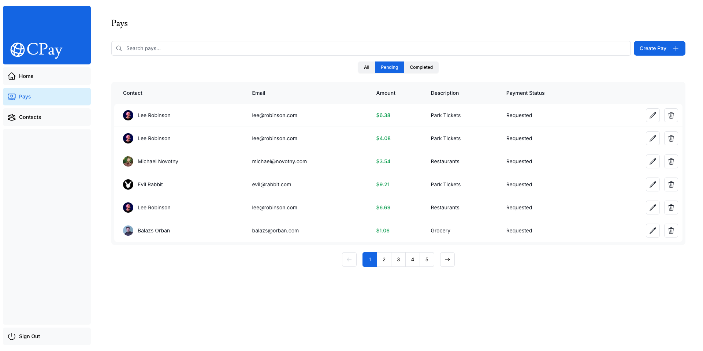

## CPay App

This is the starter template from the Next.js App Router Course. It contains the starting code for the dashboard application modified for our take home exercise purposes.

## Overview

The P2P payment market is booming, with projections estimating it will surpass $5.2 trillion by 2028. As more consumers and businesses adopt these technologies, being a part of this space positions you at the forefront of financial innovation and growth. This is your chance to contribute to a sector that is reshaping how money is transferred and managed.

The goal of this assessment is to generate sample data and persist it in memory. Then create functionality using that data to query and mutate.

## Schema

See the schemas in `./lib/definitions.ts` as well as the data in `lib/data.ts`. Part of the exercise is to define a schema that encompasses p2p transactions in a concise and scalable way.

A majority of the UI has already been implemented, but there is room for addition depending on the models you implement.

```
interface Contact {
  id: number;
  name: string
  email: string
  image_url: string;
}

interface Pay {
  id: string;
  amount: number;
  // TODO: fill in 
}
```

# Required operations

1. Pays have been partially defined. Add fields you would feel relevant for querying purposes. Think of pays similar to any p2p you are familiar with. 
2. Generate random pays to and from the pre-populated contacts for the months of a single year. 
3. Incorporate into routes and pre-made UIs by building out the queries in memory.
4. Set up create and edit/action pay. (Remember, the UI will need updating per your `pay` model)
5. Commit and share! Feel free to leave notes in your thought process.

## Bonus operations

- Filtering UI
- Group pay UI

### Hints

Boot up the app. Navigate to the dashboard. Most of these cards will show empty data. 
After you generate your data, fill these in. Replace `Recent Activity` with your data.

Click to the other routes. 

`Pays` will have a table that should have more columns. `Create Pay` will probably require more fields.

`Contacts` will use the contacts we've provided but the aggregation of data you've created. 

There are `TODO`s. Try to get to them all.

## Requirements

- Node version - v18.18.0 or higher for this version of Next.js

# Candidate README

## Bootstrap Instructions

Follow the steps below to run this application locally:

1. **Install Node.js v20**

   Make sure Node.js version 20 is installed on your system.  
   You can download it from [https://nodejs.org/en/download](https://nodejs.org/en/download)

   Verify the version by running:
   ```bash
   node -v
   ```

2. **Install dependencies**

   Navigate to the root directory of the project and run:
   ```bash
   npm install
   ```

   > ⚠️ **Disclaimer:**  
   > This application faced build issues with `next@15` when shared.  
   > To avoid these problems, `next@14` has been explicitly installed.  
   > This will be automatically handled by `npm install`.

3. **Build the application**

   Once all dependencies are installed, build the application using:
   ```bash
   npm run build
   ```

4. **Start the application**

   After a successful build, start the app with:
   ```bash
   npm run start
   ```
   The application should now be running locally. By default, it will be available at:  
   [http://localhost:3000](http://localhost:3000)

## Built Features
Showcase Dashboard View With all the Latest Pays, Received, Pending, Total Pays, Total Contacts, Recent Activity


📋 Dynamic Pays Table
A fully rendered table displaying all pays with search, sorting, and filtering (All, Completed, Pending) capabilities.


💰 Create a New Pay Record
Add a new payment entry with required fields (e.g., amount, description, contact) directly into an in-memory store.


✏️ Edit Existing Pay
Modify fields of an existing payment by matching its unique ID — updates reflect instantly in UI.


🗑️ Delete Pay Record
Remove an existing payment entry from the list with a single action — array updates in place.

🔄 In-memory State Persistence
All data operations (create/edit/delete) are managed in a temporary in-memory array — no external database required.


## 🧠 Design Considerations

I designed this application with a focus on simplicity, clarity, and extendability, while adhering to the in-memory constraint outlined in the take-home brief.

### 💳 Wallets
Each pay is associated with a contact, simulating a basic peer-to-peer wallet interaction. This abstraction lays the groundwork for implementing wallet balances or transaction histories in the future.

### 💵 Amount
Payments include amount fields with positive-only enforcement and basic validation. Decimal support ensures accurate representation of currency, and the system can be extended to support multi-currency formats later.

### 🚀 Potential Enhancements
- Introduce persistent storage (e.g., localStorage, SQLite, or Postgres via Vercel/Postgres)
- Add authentication and per-user wallets using NextAuth
- Implement optimistic UI updates or real-time sync using a lightweight state manager like Zustand
- Support *multi-currency payments* with automatic exchange rate handling and display
- Include category tagging, recurring payments, or payment reminders

### 🛠 Miscellaneous
- Used zod to enforce type-safe payloads for robust input validation
- Clean separation between data generation, logic, and UI for easier testing and future migration to backend APIs
- Mock data allows for full offline usage, making the project easy to evaluate without setup